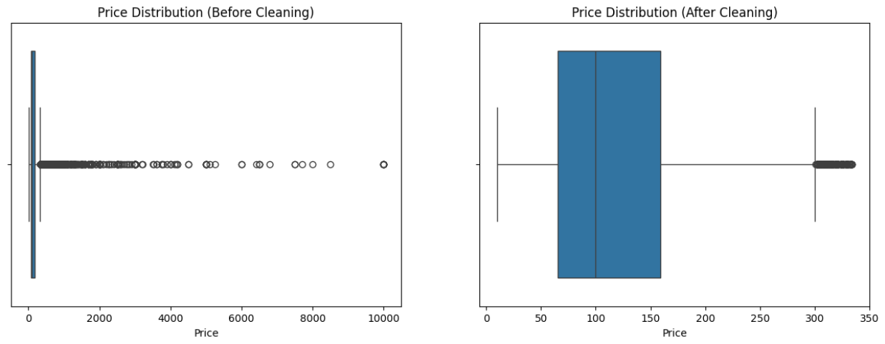

# 🧹 NYC Airbnb Data Cleaning Project

## 📌 Project Overview
Data cleaning is the essential process of fixing or removing incorrect, corrupted, duplicate, or incomplete data within a dataset to prevent unreliable outcomes. This project demonstrates comprehensive data cleaning on the **New York City Airbnb Open Dataset (2019)**.
The goal was to transform a raw, messy dataset into a high-integrity source ready for accurate analysis and predictive modeling, specifically addressing the challenges of missing data, standardization, and extreme outliers.

* **Dataset Source:** [Kaggle - NYC Airbnb Open Data](https://www.kaggle.com/datasets/dgomonov/new-york-city-airbnb-open-data).

---

## 🧠 Data Cleaning Implementation

Following the project's key concepts and challenges, the following steps were implemented:
### 1. Data Integrity & Inspection
* **Initial Audit:** Used `df.info()` and `df.describe()` to identify data type mismatches and statistical anomalies.
* **Type Conversion:** Converted the `last_review` column to a proper `datetime` format to ensure temporal data integrity.

### 2. Missing Data Handling
* **Categorical Handling:** Filled missing `name` and `host_name` entries with the string `"Unknown"` to maintain record completeness.
* **Numerical Imputation:** Assigned a value of `0` to `reviews_per_month` where listings had zero recorded reviews.
* **Date Handling:** Handled `NaN` values in the `last_review` column by filling them with a placeholder date (`1900-01-01`) to allow for consistent column operations.

### 3. Duplicate Removal
* **Validation:** Performed a check for duplicate records using the `df.duplicated().sum()` method.
* **Result:** Verified that the dataset contained no duplicate entries, ensuring data uniqueness.

### 4. Standardization
* **Text Consistency:** Standardized text fields to ensure consistent formatting across the dataset.
* **Format Consistency:** Ensured all numerical units and data formats were consistent for accurate analysis.

### 5. Outlier Detection & Removal
* **Methodology:** Applied the **Interquartile Range (IQR)** method to identify statistical outliers in the `price` column.
* **Invalid Data Removal:** Filtered out listings with a `price` of `0`, as these represent likely data entry errors.
* **Impact:** Reduced the dataset from 48,895 records to 45,912 to focus on the typical market range and improve model performance.

---

## 🛠️ Tech Stack

* **Language:** Python 3.x.
* **Libraries:** Pandas for data manipulation, NumPy for numerical operations, and Matplotlib/Seaborn for data visualization.

---

## 📁 Project Structure
* **AB_NYC_2019.csv:** The raw dataset file.
* **task3.ipynb:** The main Jupyter Notebook containing the cleaning logic and analysis.
* **boxplot.png:** The raw dataset file.
* **README.md:** Project documentation and summary.

---

## 📊 Visualizations

The impact of the cleaning process is most visible in the price distribution. By removing extreme outliers, the data becomes significantly more representative of the average NYC rental market.

---

## 🚀 How to Run the Project
1. **Clone the Repository:**
   `git clone https://github.com/yourusername/nyc-airbnb-cleaning.git`

2. **Install Dependencies:**
   `pip install pandas numpy matplotlib seaborn`

3. **Run the Notebook:**
   Open `task3.ipynb` in your preferred IDE and execute the cells to reproduce the cleaned dataset.
